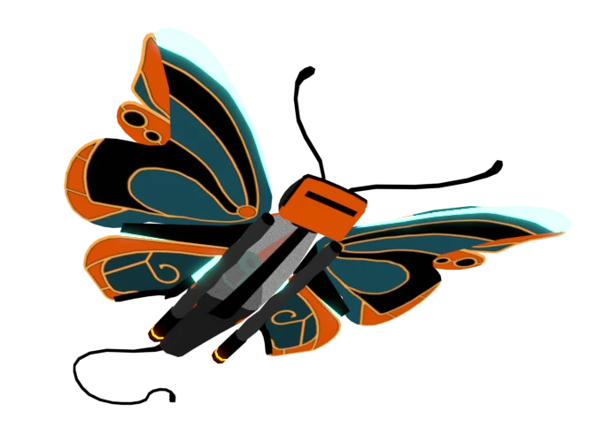
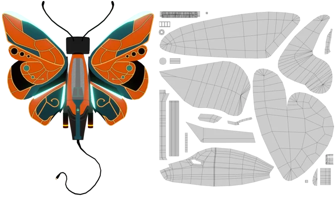

# Year of Tech Art - February: Vacuum Butterfly (Blender)

  

Like my previous [Pumpkin Toy](https://github.com/heyoeyo/YoTA_01_Pumpkin_Toy) work, this model was modeled with [Blender](https://www.blender.org/) and textured with [Krita](https://krita.org/). It's also on [Sketchfab](https://skfb.ly/oEIvS).

I started off modeling my [handheld vacuum cleaner](https://canada.bissell.com/pet-hair-eraser-pet-pro-lithium-ion-max-cordless-hand-vacuum-2390C.html), mostly for practice trying to model a 'hard-surface' object. Part way through I got bored, and figured it'd be fun to make it look like a spaceship or something. Once I started looking for references, I came across a [mechanical butterfly](https://lexica.art/prompt/dc99338a-2ded-4170-8b5e-2edc7edb2cc2), which I thought looked pretty damn cool! So that's where the model ended up going.

The reference image that I based the butterfly parts off of was actually AI generated! I really like the idea of using AI image generation as a way to provide references and/or inspiration for details and coloring, something which I think I'll continue in the future. Though hopefully I'll be making less of a direct 'copy' of the shapes, since I think I relied on the reference silouhette a bit too liberally in this case...

## Notes for future reference

### Starting with primitives

This seems like an obvious thing to do - if you're modeling a boxy shape, start with a cube, if you're modeling a tube shape, start with a cylinder, if you're modeling something rounded maybe start with a sphere etc. I didn't actually follow this advice and ended up modeling the vacuum as a series of extruded cube faces. I had a *very* difficult time getting the shape right and almost gave up as a result. I should've started with a cylinder.

### Modeling protrusions separately

I originally thought to model everything as a single 'contiguous' volume. This matches realistic notions of how objects are shaped/formed, but it really complicated the modeling process. I did eventually end up separating the head of the vacuum from the body, and the wings are all separate as well. Much easier! I think I could've taken this even further by separating out parts of the vacuum body (for example, the venting section as well as the orange striping).

### UV map sizing

I really enjoyed laying out the UVs for this model, though it was very much a learning process. To more tightly pack the UVs, I ended up scaling the wing shapes differently and rotated some of them, not knowing if this was a good or bad idea at the time.

As it turns out, rotating them is mostly fine since Krita supports rotating the canvas itself, so that it's possible to 'un-rotate' the UV shapes while working on them.

  

On the other hand, scaling the wing UVs differently from one another caused a lot of headaches in trying to get the texture details to appear at the same relative scale (the gold trim lines for example). I think I also scaled the vacuum body down too much, resulting in some blocky/blurry textures on one of the focal points of the model. So my take away is to think carefully about what kind of texturing is going to be done on each shape and scale according to that, rather than just trying to pack the UVs as tightly as possible.

### Mixing materials is messy

Originally the plan was to make the wings look metallic, similar to the reference image I was working from. Over time, I grew to like the flatter shading look (and also thought it would be weird to mix metallic wings with the plastic vacuum materials), so I figured I'd only make the gold trim metallic, that would look cool, right?

Well it *might* look cool, but trying to properly mix flat shading + blooming emission + realistic shiny metal turned out to be kind of difficult, especially once bump/normals were factored in (I wanted the metal trim to appear lifted over the rest of the wing surfaces). I just couldn't get it to look right. I gave up on this due to self-imposed time constraints, but I'd like to spend more time trying to figure this out in the future.